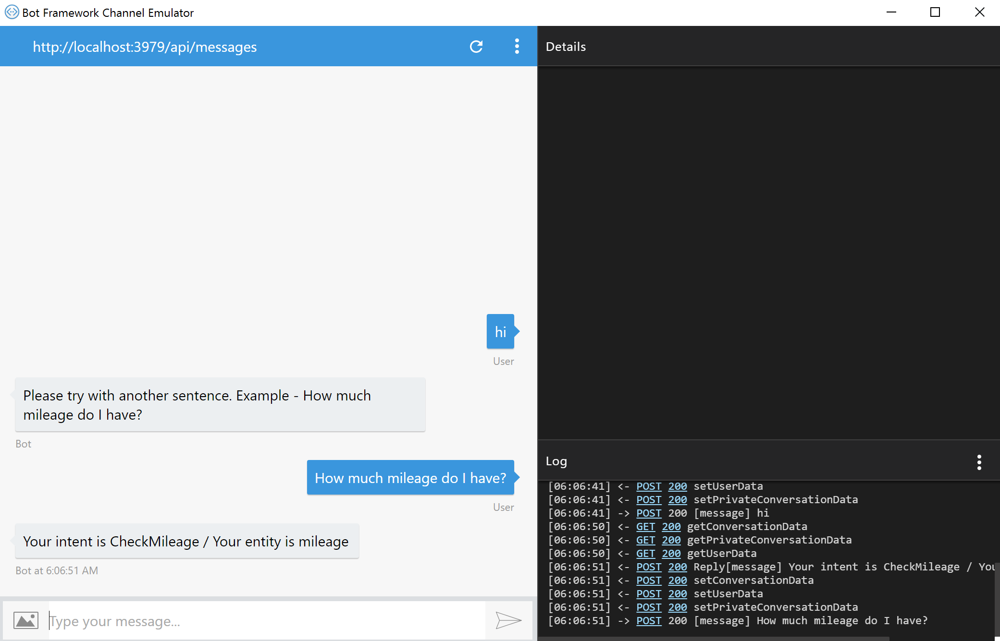

# Bot Framework
마이크로소프트에서 출시한 Bot을 만들 수 있는 프레임 워크입니다. 관련 문서 및 학습 동영상은 아래의 링크에서 찾아보실 수 있습니다.
* [dev.botframework.com](https://dev.botframework.com/)
* [Bot Design](https://review.docs.microsoft.com/en-us/botframework/designing-bots/?branch=design-center)
* [Getting Started with Bots - 영상](https://mva.microsoft.com/en-us/training-courses/getting-started-with-bots-16759)

## About EunjiBot
Bot Framework를 실습해보기 위해 C# 으로 작성한 Bot 입니다.
문장을 입력하면 [LUIS](https://www.luis.ai/)를 이용하여 문맥을 분석하고, 키워드와 의도를 찾아서 돌려 줍니다. 

## 사용방법
1. 프로젝트 다운로드
2. [Bot Framework Emulator 다운로드](https://docs.botframework.com/en-us/downloads/)

3. 프로젝트 실행 및 포트번호 확인

프로젝트 실행

포트번호 확인

4. 에뮬레이터 실행 및 Endpoint 설정

1 - Endpoint 설정 : http://localhost:포트번호/api/messages

2 - Connect 버튼 클릭

5. Bot 에게 말걸기

